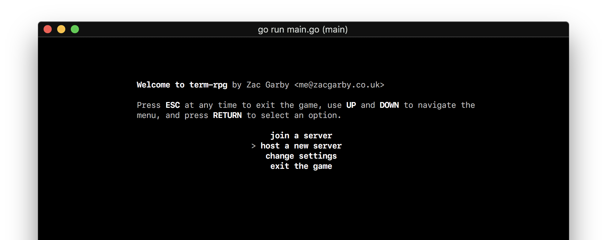

# term-rpg



Term RPG will eventually be a multiplayer terminal-based MMORPG. At the moment,
not much actually works. This is what I've done so far:

 - Server
    - The server and client communicate through gobs
    - Clients can connect
    - Only allows a new player if the new connection instantly sends client info
 - Client
    - Movement
    - Rendering of the world
 - UI
    - Text, buttons, text fields

So you can move around and the basics kind of work. What I haven't done is much
more (in rough order of how much I need to do it).

 1. A more reliable server
    - Make it actually work properly
    - Make the server ping clients periodically to check the connection is still active
 0. Make the clients handle sudden disconnects better, e.g. crashes
 0. World generation -- probably just lots of buildings
    - Will probably include adding more tile types
 0. A player list, both server- and client-side
 0. A server-side console, e.g. `kick <player>`
 0. A chat system with private and global messages
 0. Instead of having the world size as a global constant, it should be set in the
    server and all clients of that server should use the server's world size.
    - Also, it'd then make sense for the client to load the world dynamically
 0. An inventory
 0. Randomly spawned loot boxes
 0. Let the player build things
 0. Allow the players to choose what character they want to represent their player
 0. NPCs -- merchants, maybe enemies too
 0. Maybe host a server on Heroku or something so I don't have to leave my computer on

## How to use it

Get the code and run it with these commands:

```
go get github.com/Zac-Garby/term-rpg
cd $GOPATH/src/github.com/Zac-Garby/term-rpg
go run main.go
```

I might also put some binaries on GitHub at some point.

Running these commands will open the main menu, where you can choose to either
host a server or join one as a client. Hosting a server will prompt you to enter
the port to host on (it's recommended to use the default one in there already),
and joining a game will ask for a username and an address to connect to.
